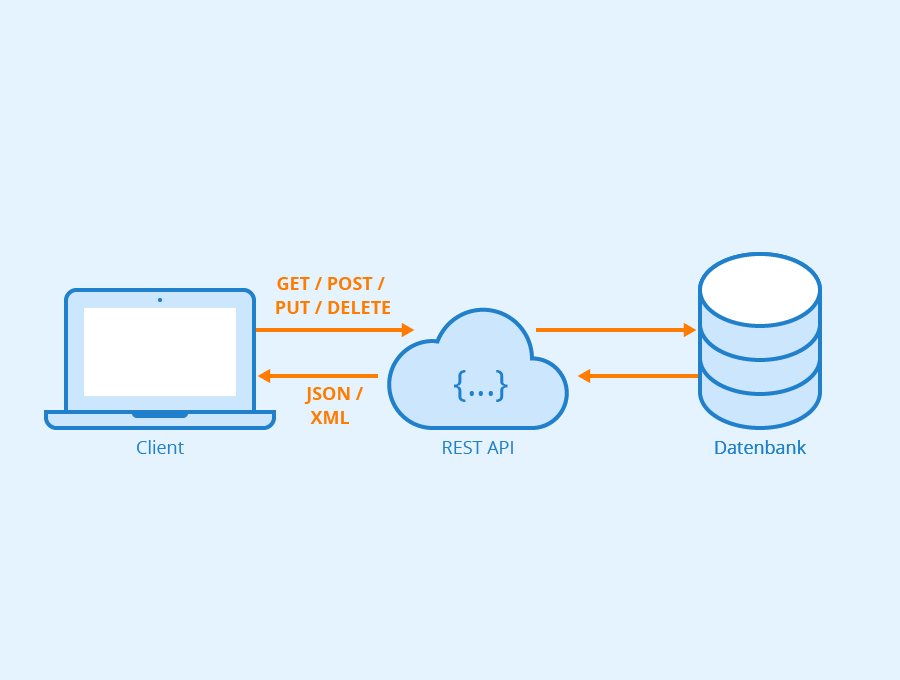
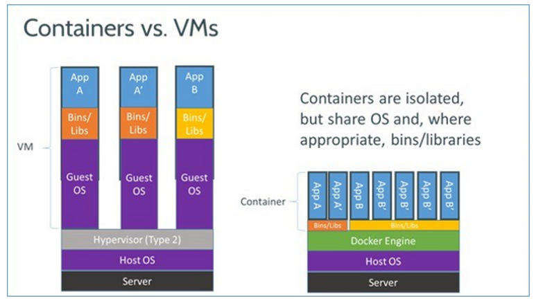
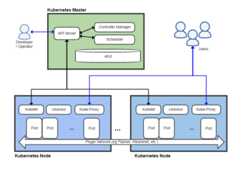
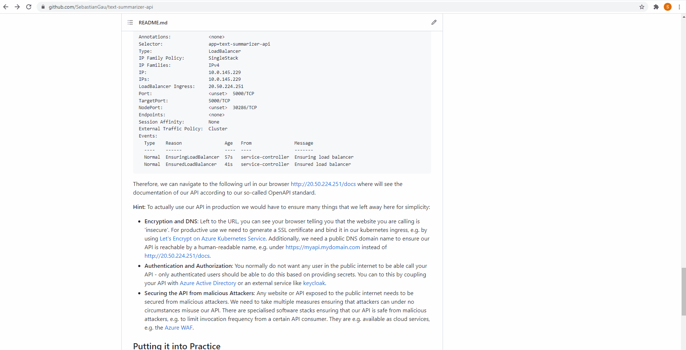

# Informatics, Computing, Digital - Seminar for Patent Attorneys

<!-- vscode-markdown-toc -->
* 1. [The Basics - What is a REST API and why developers use REST APIs](#TheBasics-WhatisaRESTAPIandwhydevelopersuseRESTAPIs)
* 2. [Developing the API](#DevelopingtheAPI)
	* 2.1. [Creating a REST API Template](#CreatingaRESTAPITemplate)
	* 2.2. [Adding Languages Processing Libraries](#AddingLanguagesProcessingLibraries)
* 3. [Deploying the API](#DeployingtheAPI)
	* 3.1. [Building the Container Image](#BuildingtheContainerImage)
	* 3.2. [Deploying the Container Image](#DeployingtheContainerImage)
* 4. [Putting it into Practice](#PuttingitintoPractice)
	* 4.1. [Example Texts](#ExampleTexts)
	* 4.2. [Invocation via WebUI](#InvocationviaWebUI)
	* 4.3. [Invocation of the API via PowerShell on your machine](#InvocationoftheAPIviaPowerShellonyourmachine)
* 5. [Challenges](#Challenges)
	* 5.1. [Challenge 1](#Challenge1)
	* 5.2. [Challenge 2](#Challenge2)
	* 5.3. [Challenge 3](#Challenge3)

<!-- vscode-markdown-toc-config
	numbering=true
	autoSave=true
	/vscode-markdown-toc-config -->
<!-- /vscode-markdown-toc -->

This repository contains code and tutorial examples to demonstrate patent attorneys which technologies are the back bone of digitalization today. In this seminar, we will develop a REST application programmer interface (API) that is capable of summarizing text, e.g. patent text, to a specified length. The seminar was specifically designed to be doable with minimum requirements on the client PCs of participants.


##  1. <a name='TheBasics-WhatisaRESTAPIandwhydevelopersuseRESTAPIs'></a>The Basics - What is a REST API and why developers use REST APIs

**ToDo by Robert - currently proposal from Sebastian**

A REST API can be used to exchange data between two computer systems:



A REST API is characterized as follows:

- **Stateless client/server protocol**: Each HTTP contains all the necessary information to run it, which means that neither the client nor the server need to remember any previous state to satisfy it. Be that as it may, some HTTP applications incorporate a cache memory. This configures what is known as the stateless client-cache-server protocol: it is possible to define some of the responses to specific HTTP requests as cachable, so the client can run the same response for identical requests in the future. However, the fact that the option exists doesn't mean it is the most recommended.
- **Well-defined Operation Set**:There are four very important data transactions in any REST system and HTTP specification: POST (create), GET (read and consult), PUT (edit) and DELETE.
- **URI-oriented**: Objects in REST are always manipulated from the URI. It is the URI and no other element that is the sole identifier of each resource in this REST system. The URI allows us to access the information in order to change or delete it, or for example to share its exact location with third parties.
- **Uniform interface**: to transfer data, the REST system applies specific actions (POST, GET, PUT and DELETE) on the resources, provided they are identified with a URI. This makes it easier to obtain a uniform interface that systematizes the process with the information.
Layer system: hierarchical architecture between the components. Each layer has a functionality within the REST system.
- **Use of hypermedia**: hypermedia is a term coined by Ted Nelson in 1965 and is an extension of the concept of hypertext. This concept, taken to web page development, is what allows the user to browse the set of objects through HTML links. In the case of a REST API, the concept of hypermedia explains the capacity of an app development interface to provide the client and the user with the adequate links to run specific actions on the data.

From a developer perspective, a REST API has the following advantages:

- **Separation between the client and the server**: the REST protocol totally separates the user interface from the server and the data storage. This has some advantages when making developments. For example, it improves the portability of the interface to other types of platforms, it increases the scalability of the projects, and allows the different components of the developments to be evolved independently.
- **Visibility, reliability and scalability**: The separation between client and server has one evident advantage, and that is that each development team can scale the product without too much problem. They can migrate to other servers or make all kinds of changes in the database, provided the data from each request is sent correctly. The separation makes it easier to have the front and the back on different servers, and this makes the apps more flexible to work with.
- **The REST API is always independent of the type of platform or languages**: The REST API always adapts to the type of syntax or platforms being used, which gives considerable freedom when changing or testing new environments within the development. With a REST API you can have PHP, Java, Python or Node.js servers. The only thing is that it is indispensable that the responses to the requests should always take place in the language used for the information exchange, normally XML or JSON.

##  2. <a name='DevelopingtheAPI'></a>Developing the API

The API will be developed using Python - one of the most popular multi-purpose programming languages.

###  2.1. <a name='CreatingaRESTAPITemplate'></a>Creating a REST API Template

ToDO

###  2.2. <a name='AddingLanguagesProcessingLibraries'></a>Adding Languages Processing Libraries

We will use [sumy](https://pypi.org/project/sumy/) to do the language processing. To use the library, we first need to add the dependency to the requirements.txt file in the repository root (and restarting our development container if you use one):

```txt
...
sumy==0.9.0
```

Afterwards, we can add the following imports at the top of the main.py file:

```python
from sumy.parsers.html import HtmlParser
from sumy.parsers.plaintext import PlaintextParser
from sumy.nlp.tokenizers import Tokenizer
from sumy.summarizers.lsa import LsaSummarizer as Summarizer
from sumy.nlp.stemmers import Stemmer
from sumy.utils import get_stop_words
import nltk
nltk.download('punkt')
```

In the next step, we have to add a function to invoke the language processing library using a REST request. This is done by adding the following lines of code in main.py:

```python
class SummarizeTextRequest(BaseModel):
    text: str = ""
    url: str = ""
    language: str = ""
    sentencecount: int = 10

class SummarizeTextResponse(BaseModel):
    summarizedtext: str = ""
    executiontime: float = 0

@app.post("/summarize", response_model=SummarizeTextResponse)
def invoke(request: SummarizeTextRequest) -> SummarizeTextResponse:
    my_logger.info("invocation starting")
    resp = SummarizeTextResponse()
    start = timer()

    # prepare text summary
    stemmer = Stemmer(request.language)
    summarizer = Summarizer(stemmer)
    summarizer.stop_words = get_stop_words(request.language)
    
    if request.text:
        parser = PlaintextParser.from_string(request.text, Tokenizer(request.language))
    elif request.url:
        parser = HtmlParser.from_url(request.url, Tokenizer(request.language))
    else:
        raise ValueError('please specify text or url parameter in the request')

    for sentence in summarizer(parser.document, request.sentencecount):
        print(sentence)
        resp.summarizedtext = resp.summarizedtext + str(sentence)

    end = timer()
    resp.executiontime = end - start
    return resp
```

This will ensure that the API has a /summarize endpoint accepting a POST request wherein the http body contains our text to summarize.

##  3. <a name='DeployingtheAPI'></a>Deploying the API

We will deploy the API using **Docker**. Google describes Docker as follows:


>Docker is an open source containerization platform. It enables developers to package applications into containers—standardized executable components combining application source code with the operating system (OS) libraries and dependencies required to run that code in any environment.

In other words, Docker is a virtualization technology that allows us to execute computer programs, in this case our API, with all dependencies shipped within a single container (and file). The only runtime dependency of a container is an OCI compliant container runtime, which relies on standard features existent in the Linux kernel. The following picture demonstrates the relation between a virtual machine and a container image:




###  3.1. <a name='BuildingtheContainerImage'></a>Building the Container Image

To host our API based on a container image we have to put our code into a container. How this is done is defined by the Dockerfile residing in the repository root:

```dockerfile
FROM tiangolo/uvicorn-gunicorn-fastapi:python3.7

WORKDIR /app

# Copy and install requirements
COPY requirements.txt /app
RUN pip install --upgrade pip
RUN pip install --no-cache-dir -r requirements.txt

# Copy contents from your local to your docker container
COPY ./app /app

# execution is handled by the base image
# CMD ["python","main.py"]
```

Based on the dockerfile we can execute the following bash commands in the repository root:

```bash
# at first, we log in to docker hub
docker login -u sebastiangau -p xxx
# with this command, we build the image locally on our development machine and give it a name
# this is done by our dockerfile (we tell docker to look for the dockerfile with the dot '.' here)
docker build . -t text-summarizer-api
# we now 'tag' the container image so that docker knows where to upload our baked image - in this case into my personal repository in docker hub
docker tag text-summarizer-api sebastiangau/text-summarizer-api:v1
# we push (=upload) the image from our local development computer to docker hub, a centralized storage service for containers. this takes some time
docker push sebastiangau/text-summarizer-api:v1
```

**IMPORTANT: If you want to try this out you need to create your own docker hub account!** 
Now our container image is ready to be executed in the cloud.


###  3.2. <a name='DeployingtheContainerImage'></a>Deploying the Container Image

We will deploy the API into (Azure) cloud using Azure Kubernetes Service. How this service is set up cannot be explained here, but you can find a tutorial [here](https://docs.microsoft.com/en-us/azure/aks/kubernetes-walkthrough-portal). However, Wikipedia describes kubernetes as follows:

*Kubernetes is an open-source container-orchestration system for automating computer application deployment, scaling, and management. It was originally designed by Google and is now maintained by the Cloud Native Computing Foundation. It aims to provide a "platform for automating deployment, scaling, and operations of container workloads". It works with a variety of container runtimes such as Docker, Containerd, and CRI-O. Kubernetes originally interfaced exclusively with the Docker runtime[8] through a "Dockershim"; however, the shim has since been deprecated in favor of directly interfacing with the container through containerd, or replacing Docker with a runtime that is compliant with the Container Runtime Interface (CRI) introduced by Kubernetes in 2016. Many cloud services offer a Kubernetes-based platform or infrastructure as a service (PaaS or IaaS) on which Kubernetes can be deployed as a platform-providing service. Many vendors also provide their own branded Kubernetes distributions.*

The following picture shows how kubernetes works from an architectural point of view:



We will now fire commands to the kubernetes API server using the kubernetes command line client, called *kubectl*, to instruct kubernetes to execute our API container image. Kubernetes is normally configured in a declarative fashion using so-called 'YAML' files. For deploying our API they look like this:

```yaml
apiVersion: apps/v1
kind: Deployment
metadata:
  name: text-summarizer-api-deployment
  labels:
    app: text-summarizer-api-app
spec:
  replicas: 1
  selector:
    matchLabels:
      app: text-summarizer-api-app
  template:
    metadata:
      labels:
        app: text-summarizer-api-app
    spec:
      containers:
      - name: text-summarizer-api-container
        image: sebastiangau/text-summarizer-api:v1
        imagePullPolicy: Always
        ports:
        - containerPort: 80
---
apiVersion: v1
kind: Service
metadata:
  name: text-summarizer-api-service
spec:
  selector:
    app: text-summarizer-api-app
  ports:
  - protocol: TCP
    port: 4999
    targetPort: 80
  type: LoadBalancer
```

Note that the identifer *sebastiangau/text-summarizer-api:v1* we used to push our container to the container registry (Docker Hub) is contained in the YAML manifest. With the following commands we send the manifest to the kubernetes API server:

```bash
kubectl create namespace text-summarizer-api-namespace
kubectl apply -f .\deploy-api-on-kubernetes.yaml -n text-summarizer-api-namespace
```

We afterwards find out which external IP was assigned by Azure to expose our API:

```bash
kubectl describe service text-summarizer-api-service -n text-summarizer-api-namespace
```

We can see the external IP in the command output:

```bash
Name:                     text-summarizer-api-service
Namespace:                text-summarizer-api-namespace
Labels:                   <none>
Annotations:              <none>
Selector:                 app=text-summarizer-api-app
Type:                     LoadBalancer
IP Family Policy:         SingleStack
IP Families:              IPv4
IP:                       10.0.202.112
IPs:                      10.0.202.112
LoadBalancer Ingress:     20.50.224.251
Port:                     <unset>  4999/TCP
TargetPort:               80/TCP
NodePort:                 <unset>  30865/TCP
Endpoints:                10.244.2.37:80
Session Affinity:         None
External Traffic Policy:  Cluster
Events:
  Type    Reason                Age                  From                Message
  ----    ------                ----                 ----                -------
  Normal  EnsuringLoadBalancer  4m25s (x4 over 10h)  service-controller  Ensuring load balancer
  Normal  EnsuredLoadBalancer   4m10s (x2 over 10h)  service-controller  Ensured load balancer
```

Therefore, we can navigate to the following url in our browser [http://20.50.224.251:4999/docs](http://20.50.224.251:4999/docs) where we will see a standardized documentation of our API based on the OpenAPI standard.

**Hint:** To actually use our API in production we would have to ensure many things that we left away here for simplicity:
 - **Encryption and DNS**: Left to the URL, you can see your browser telling you that the website you are calling is 'insecure'. For productive use we need to generate a SSL certificate and bind it in our kubernetes ingress, e.g. by using [Let's Encrypt on Azure Kubernetes Service](https://docs.microsoft.com/de-de/azure/aks/ingress-tls). Additionally, we need a public DNS domain name to ensure our API is reachable by a human-readable name, e.g. under [https://myapi.mydomain.com](https://myapi.mydomain.com) instead of [http://20.50.224.251:4999/docs](http://20.50.224.251:4999/docs).
 - **Authentication and Authorization**: You normally do not want any user in the public internet to be able call your API - only authenticated users should be able to do this based on providing secrets. You can to this by coupling your API with [Azure Active Directory](https://azure.microsoft.com/de-de/services/active-directory/) or an external service like [keycloak](https://www.keycloak.org/).
 - **Securing the API from malicious Attackers**: Any website or API exposed to the public internet needs to be secured from malicious attackers. We need to take multiple measures ensuring that misuse of our API is impossible. A possible misuse could be that an attacker uses a remote code execution vulnerability to use our API container to start mining of cryptocurrencies. There are specialised software stacks ensuring that our API is safe from these kind of attackes, e.g. to limit invocation frequency from a certain API consumer and detect suspect requests. They are e.g. available as cloud services, e.g. the [Azure WAF](https://azure.microsoft.com/de-de/services/web-application-firewall/).
 - **DevOps and Automation**: The steps of bulding the container image and deploying to a runtime environment are normally automated after pushing changes to the source code repository. This is called [CI/CD](https://en.wikipedia.org/wiki/CI/CD).


##  4. <a name='PuttingitintoPractice'></a>Putting it into Practice


###  4.1. <a name='ExampleTexts'></a>Example Texts

We will invoke the API using the following test text containing 7 sentences, you can copy the text to test it yourself.

```text
Johannes Gutenberg (1398 – 1468) was a German goldsmith and publisher who introduced printing to Europe. His introduction of mechanical movable type printing to Europe started the Printing Revolution and is widely regarded as the most important event of the modern period. It played a key role in the scientific revolution and laid the basis for the modern knowledge-based economy and the spread of learning to the masses.Gutenberg many contributions to printing are: the invention of a process for mass-producing movable type, the use of oil-based ink for printing books, adjustable molds, and the use of a wooden printing press. His truly epochal invention was the combination of these elements into a practical system that allowed the mass production of printed books and was economically viable for printers and readers alike. In Renaissance Europe, the arrival of mechanical movable type printing introduced the era of mass communication which permanently altered the structure of society. The relatively unrestricted circulation of information—including revolutionary ideas—transcended borders, and captured the masses in the Reformation. The sharp increase in literacy broke the monopoly of the literate elite on education and learning and bolstered the emerging middle class.
```

We can also invoke the API resources hosted under external URLs. The API will then pull the text from this URL, summarize it and return the summarized results to us. You will do some practical stuff later with this.


###  4.2. <a name='InvocationviaWebUI'></a>Invocation via WebUI

The [OpenAPI specification](https://swagger.io/specification/) contains guidelines how REST APIs can be documented in a standard format. In our python code, we use a package that automatically creates the API documentation page based on an automatic analysis of our code. **Question:** Can you find out where in the code this package is referenced?



###  4.3. <a name='InvocationoftheAPIviaPowerShellonyourmachine'></a>Invocation of the API via PowerShell on your machine

You can invoke the API using the following powershell command. To open PowerShell, press the windows key and r at the same time, type in 'powershell' and press enter.

```powershell
$body = @{text='Johannes Gutenberg (1398 – 1468) was a German goldsmith and publisher who introduced printing to Europe. His introduction of mechanical movable type printing to Europe started the Printing Revolution and is widely regarded as the most important event of the modern period. It played a key role in the scientific revolution and laid the basis for the modern knowledge-based economy and the spread of learning to the masses.Gutenberg many contributions to printing are: the invention of a process for mass-producing movable type, the use of oil-based ink for printing books, adjustable molds, and the use of a wooden printing press. His truly epochal invention was the combination of these elements into a practical system that allowed the mass production of printed books and was economically viable for printers and readers alike. In Renaissance Europe, the arrival of mechanical movable type printing introduced the era of mass communication which permanently altered the structure of society. The relatively unrestricted circulation of information—including revolutionary ideas—transcended borders, and captured the masses in the Reformation. The sharp increase in literacy broke the monopoly of the literate elite on education and learning and bolstered the emerging middle class.';language='english';sentencecount=3}
$response = Invoke-WebRequest -Uri http://20.50.224.251:4999/summarize -Method 'Post' -Body ($body|ConvertTo-Json) -ContentType "application/json"
$response.Content
```


##  5. <a name='Challenges'></a>Challenges

This section contains exercises in ascending difficulty. To do the challenges, only a Windows 10 PC with PowerShell and a text editor is required, so anyone should be able to participate. 

###  5.1. <a name='Challenge1'></a>Challenge 1

*The API can also be used to download text from an external URL and summarize it. Using the OpenAPI documentation, find out how to invoke the API to summarize Kafkas 'Metamorphosis' that is available under the following URL: [https://www.gutenberg.org/cache/epub/5200/pg5200.txt](https://www.gutenberg.org/cache/epub/5200/pg5200.txt)*

<details>
  <summary>Solution to Challenge 1</summary>
  Use the WebUI as shown in the embedded gif, but put in the following request body:

```json
{
"text": "",
"url": "https://www.gutenberg.org/cache/epub/5200/pg5200.txt",
"language": "english",
"sentencecount": 10
}
```

</details>


###  5.2. <a name='Challenge2'></a>Challenge 2

*Invoke the API using PowerShell to summarize Kafkas 'Metamorphosis'!* 

<details>
  <summary>Solution to Challenge 2</summary>

```powershell
$body = @{url='https://www.gutenberg.org/cache/epub/5200/pg5200.txt';language='english';sentencecount=3}
$response = Invoke-WebRequest -Uri http://20.50.224.251:4999/summarize -Method 'Post' -Body ($body|ConvertTo-Json) -ContentType "application/json"
$response.Content
```

</details>


###  5.3. <a name='Challenge3'></a>Challenge 3

*Can you explain the output of the following PowerShell command, referring to the inner working principles of the text summarization library we used?* (This has to do with understanding the logic of the language processing library, so if you are only interested in coding, leave it away).

```powershell
$body = @{text='I like Pizza. I really like Pizza. Pizza is awesome. Pizza is love. Pizza is life. But Doener is OK as well. Life would be miserable without any of them.';language='english';sentencecount=2}
$response = Invoke-WebRequest -Uri http://20.50.224.251:4999/summarize -Method 'Post' -Body ($body|ConvertTo-Json) -ContentType "application/json"
$response.RawContent
```

<details>
  <summary>Solution to Challenge 3</summary>

  One could expect that the summarized version should contain more sentences containing 'Pizza', but this is not the case. The language processing library obviously counts the number of word occurrences and assigns priorities to the individual sentences, but as soon as the high-priority word 'Pizza' is covered within one of the summarized sentences, the library assigns a higher priority to sentences containing words that occurr in other contexts in combination with 'Pizza', which in our case is 'life'.

</details>

### Challenge 4

The API has features to store and invoke external python code. You can register a python function with the following interface (interface means the function requires a list as input returns a list)

```python
from typing import List


def invoke(argument_list: List[str]) -> List[str]:
    intsum = int(argument_list[0]) + int(argument_list[1])
    return [str(intsum)]
```

You can ause the following instructions and PowerShell script to push code to the API:
 1. open Windows PowerShell by pressing the windows key + R at the same time and enter 'powershell'
 2. enter 'cd Desktop' into the console and press enter
 3. create a text file on your by entering 'New-Item mycode.txt' into the console and press enter
 4. open the file by entering 'start mycode.txt' into the console and press enter
 5. copy the contents from the example function into the text editor and press Str + s on your keyboard

Use the following PowerShell script to update the remote code (you can just copy and paste it):

```powershell
$pythoncode = Get-Content mycode.txt -Raw
$functionid = 42
$url = '20.50.224.251:4999'
$body = @{functionid = $functionid; pythoncode = $pythoncode | Out-String}
$response = Invoke-WebRequest -Uri http://$url/registerfunction -Method 'Post' -Body ($body|ConvertTo-Json) -ContentType "application/json"
$response.RawContent
```

Use the following powershell script to invoke your function:

```powershell
$argumentlist = 1, 2
$functionid = 42
$url = '20.50.224.251:4999'
$body = @{functionid = $functionid; arguments = $argumentlist}
$response = Invoke-WebRequest -Uri http://$url/invokefunction -Method 'Post' -Body ($body|ConvertTo-Json) -ContentType "application/json"
$response.RawContent
```

You can also do the same by pasting the code in the OpenAPI web documentation and invoke the /registerfunction endpoint. Due to JSON limitations the code needs to be put into one line:

```python
from typing import List\n\ndef invoke(argument_list: List[str]):\n  intsum = int(argument_list[0]) + int(argument_list[1])\n  return [str(intsum)]
```

writing the code into one line is quite confusing, thats why we use powershell to upload our code.


