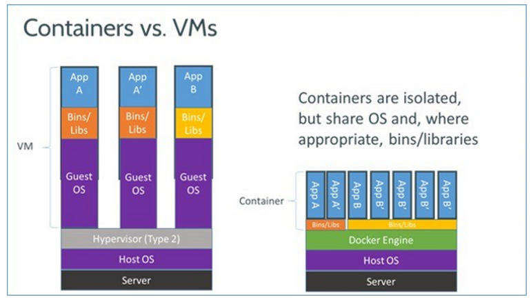

# Informatics, Computing, Digital - Seminar for Patent Attorneys

This repository contains code and tutorial examples to demonstrate patent attorneys which technologies are the back bone of digitalization today. In this seminar, we will develop a REST application programmer interface (API) that is capable of summarizing text, e.g. patent text, to a specified length.

## The Basics - What is a REST API and why developers use REST APIs

TBD by Robert

## Deploying the API

We will deploy the API using **Docker** . Google describes Docker as follows:

```
Docker is an open source containerization platform. It enables developers to package applications into containers—standardized executable components combining application source code with the operating system (OS) libraries and dependencies required to run that code in any environment.
```

In other words, docker is a virtualization technology that allows us to execute computer programs, in this case our API, with all depencies shipped within a single container (and file). The only runtime dependency of a container is an OCI compliant container runtime, which relies mostly on standard features in the Linux kernel. The following picture demonstrates the relation between a virtual machine and a container image:




### Building the Container Image

Prior to being able to execute the container image containg our code we have to put our code into a container. How this is done is defined by our dockerfile:

```dockerfile
FROM tiangolo/uvicorn-gunicorn-fastapi:python3.7

WORKDIR /app

# Copy and install requirements
COPY requirements.txt /app
RUN pip install --upgrade pip
RUN pip install --no-cache-dir -r requirements.txt
EXPOSE 5000

# Copy contents from your local to your docker container
COPY ./app /app

# execution is handled by the base image
# CMD ["python","main.py"]
```

Based on the dockerfile we can execute the following bash commands:

```bash
# at first, we log in to docker hub
docker login -u sebastiangau -p xxx
# with this command, we build the image locally on our development machine and give it a name
docker build . -t text-summarizer-api
# we now 'tag' the container image so that docker knows where to upload our baked image - in this case into my personal repository in docker hub
docker tag text-summarizer-api sebastiangau/text-summarizer-api:v1
# we push (=upload) the image from our local development machine to docker hub, this takes some time
docker push sebastiangau/text-summarizer-api:v1
```

Now our container image is ready to be executed in the cloud!


### Deploying the Container Image

We will deploy the API into (Azure) cloud using Azure Kubernetes Service.

```bash
kubectl create namespace text-summarizer-api-namespace
kubectl apply -f .\deploy-api-on-kubernetes.yaml -n text-summarizer-api-namespace
```

We afterwards find out which external IP was assigned by Azure to expose our API:

```bash
kubectl describe service text-summarizer-api-service -n text-summarizer-api-namespace
```

We can see the external IP in the command output:

```bash
Name:                     text-summarizer-api-service
Namespace:                text-summarizer-api-namespace
Labels:                   <none>
Annotations:              <none>
Selector:                 app=text-summarizer-api
Type:                     LoadBalancer
IP Family Policy:         SingleStack
IP Families:              IPv4
IP:                       10.0.145.229
IPs:                      10.0.145.229
LoadBalancer Ingress:     20.50.224.251
Port:                     <unset>  5000/TCP
TargetPort:               5000/TCP
NodePort:                 <unset>  30286/TCP
Endpoints:                <none>
Session Affinity:         None
External Traffic Policy:  Cluster
Events:
  Type    Reason                Age   From                Message
  ----    ------                ----  ----                -------
  Normal  EnsuringLoadBalancer  57s   service-controller  Ensuring load balancer
  Normal  EnsuredLoadBalancer   41s   service-controller  Ensured load balancer
```

Therefore, we can navigate to the following url in our browser [http://20.50.224.251/docs](http://20.50.224.251/docs) where will see the documentation of our API according to our  so-called OpenAPI standard.


## Putting it into Practice


### Example Texts

We will invoke the API using the following test text:

```text
Johannes Gutenberg (1398 – 1468) was a German goldsmith and publisher who introduced printing to Europe. His introduction of mechanical movable type printing to Europe started the Printing Revolution and is widely regarded as the most important event of the modern period. It played a key role in the scientific revolution and laid the basis for the modern knowledge-based economy and the spread of learning to the masses.Gutenberg many contributions to printing are: the invention of a process for mass-producing movable type, the use of oil-based ink for printing books, adjustable molds, and the use of a wooden printing press. His truly epochal invention was the combination of these elements into a practical system that allowed the mass production of printed books and was economically viable for printers and readers alike. In Renaissance Europe, the arrival of mechanical movable type printing introduced the era of mass communication which permanently altered the structure of society. The relatively unrestricted circulation of information—including revolutionary ideas—transcended borders, and captured the masses in the Reformation. The sharp increase in literacy broke the monopoly of the literate elite on education and learning and bolstered the emerging middle class.
```

We can also invoke the API using the following URL [https://www.gutenberg.org/cache/epub/5200/pg5200.txt](https://www.gutenberg.org/cache/epub/5200/pg5200.txt) containing 'Metamorphosis' by Frank Kafka. The API will then pull the text from this URL, summarize it and return the summarized results to us.


### Invocation of the API via PowerShell on your machine

(THIS IS NOT YET WORKING) You can invoke the API using the following powershell command. 

```powershell
$postParams = @{text='Johannes Gutenberg (1398 – 1468) was a German goldsmith and publisher who introduced printing to Europe. His introduction of mechanical movable type printing to Europe started the Printing Revolution and is widely regarded as the most important event of the modern period. It played a key role in the scientific revolution and laid the basis for the modern knowledge-based economy and the spread of learning to the masses.Gutenberg many contributions to printing are: the invention of a process for mass-producing movable type, the use of oil-based ink for printing books, adjustable molds, and the use of a wooden printing press. His truly epochal invention was the combination of these elements into a practical system that allowed the mass production of printed books and was economically viable for printers and readers alike. In Renaissance Europe, the arrival of mechanical movable type printing introduced the era of mass communication which permanently altered the structure of society. The relatively unrestricted circulation of information—including revolutionary ideas—transcended borders, and captured the masses in the Reformation. The sharp increase in literacy broke the monopoly of the literate elite on education and learning and bolstered the emerging middle class.';language='english';sentencecount=6}
Invoke-WebRequest -Uri http://localhost:5000/summarize -Method POST -Body $postParams
```

### Invocation via WebUI

TBD

### Invocation for an external URL

TBD


